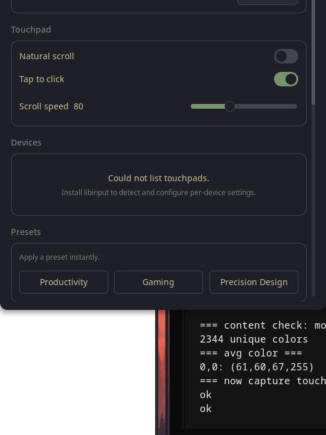

# Noctalia Touchpad Settings

A production-ready **Noctalia v5 settings panel plugin** that configures
touchpad behavior — pointer speed, acceleration profile, natural scroll, scroll
speed and tap-to-click — from a native declarative `ui.*` panel. No manual
config file editing required: every change applies immediately (live preview)
and persists across reboots.

Pair with the separate **Mouse Settings** plugin (`dika/mouse-settings`) for
mice.

Target environment: **Noctalia v5 (Wayland / Niri)**, **Plugin API 28**.
Built against the official Noctalia plugin API (`noctalia.d.luau`, API references).

## Screenshot



---

## Features

- **Pointer speed** slider (`-1.0` → `1.0`, step `0.05`, default `0`) with a
  live numeric readout. Applies to the preview while dragging; persists and
  reloads Niri when you release (`onDragEnd`).
- **Acceleration profile** select (Adaptive / Flat / Custom).
- **Natural scroll** toggle.
- **Tap to click** toggle.
- **Scroll speed** slider (`10`–`200`, default `80`).
- **Per-device settings**: auto-detects connected touchpads and gives each a
  page (pointer speed, acceleration, natural scroll, scroll speed, tap to
  click). Niri (v26) applies one pointer profile to all touchpads, so these
  overrides feed the global touchpad settings.
- **Test Area**: a live preview (a hover grid of `ui.box` elements with a
  cursor trail and a movement-speed indicator — API 28 compatible). Nothing is
  saved from it.
- **Presets**: Productivity, Gaming, Precision Design — click to apply
  instantly with the selected card highlighted.
- **Reset to Default** with an inline confirmation state.
- **Live update**: every control writes the generated KDL and reloads Niri via
  `niri msg action load-config-file` (fallback `reload-config`) — no logout or
  restart.
- **Toasts** (`noctalia.notify`) for every action, with one automatic retry on
  failure.
- **Durable persistence** in `noctalia.pluginDataDir()` (survives reboots and
  plugin updates), plus manifest-`[[setting]]` schema shown in Settings → Plugins.
- **No polling**: device detection runs once per panel open via
  `noctalia.runAsync("libinput list-devices")`.

---

## Layout

Panels describe their UI declaratively (`panel.render(ui column …)`). Section
order:

1. Header
2. Pointer
3. Touchpad (natural scroll, tap to click, scroll speed)
4. Devices
5. Presets
6. Preview
7. Advanced
8. Reset

---

## Structure

```
noctalia-touchpad-settings/
├── plugin.toml      # Manifest: settings schema, panel, widget, shortcut (API 28)
├── panel.luau       # UI panel entry (onOpen; builds ui.* tree; wires callbacks)
├── settings.luau    # Data model: defaults, presets, validation, JSON store
├── service.luau     # Detection + spec-required helper API
├── libinput.luau    # Generates/writes `noctalia-touchpad.kdl`, reloads Niri
├── preview.luau     # Hover-grid cursor trail sampling + speed meter
├── bar.luau         # Bar widget: hand-finger glyph that toggles the panel
├── shortcut.luau    # Control-center tile that toggles the panel
└── translations/en.json
```

| File            | Responsibility                                                   |
| --------------- | ---------------------------------------------------------------- |
| `panel.luau`    | Entries (`onOpen`), builds ui.* tree, wires controls.            |
| `settings.luau` | Data model: defaults, presets, validation, JSON file store.      |
| `service.luau`  | `libinput list-devices` detection (touchpads), spec API, commit. |
| `libinput.luau` | Generates/writes KDL, ensures include, reloads Niri.             |
| `preview.luau`  | Hover-grid cursor trail sampling + speed meter.                  |
| `bar.luau`      | Bar widget: hand-finger glyph that toggles the panel.          |
| `shortcut.luau` | Control-center tile that toggles the panel.                      |

---

## Service API

`service.luau` exposes the spec-required helpers (operating on the in-memory
`cfg` table):

- `getMouseDevices(cfg)` / `refreshDevices(cfg, cb)` / `detectDevices(cb)`
- `getPointerSpeed(cfg)` / `setPointerSpeed(cfg, value)`
- `getAccelProfile(cfg)` / `setAccelerationProfile(cfg, profile)`
- `getNaturalScroll(cfg)` / `setNaturalScroll(cfg, enabled)`
- `getScrollSpeed(cfg)` / `setScrollSpeed(cfg, value)`
- `applyPreset(cfg, name, onSuccess, onError)`
- `applyPresetToDevice(device, name)`
- `commit(cfg, onSuccess, onError)` / `resetAll(cfg, onSuccess, onError)`
- `reloadInputConfig(onSuccess, onError)` (via `libinput.luau`)

---

## Configuration storage

Settings persist durably as JSON in
`pluginDataDir()/touchpad-config.json`, read on startup:

```json
{
  "pointer_speed": 0.35,
  "accel_profile": "adaptive",
  "natural_scroll": false,
  "scroll_speed": 80,
  "tap_to_click": true,
  "devices": [
    { "name": "ELAN0678:00 04F3:3195 Touchpad", "pointer_speed": 0.1,
      "accel_profile": "adaptive", "natural_scroll": false,
      "scroll_speed": 80, "tap_to_click": true }
  ]
}
```

The manifest also declares `[[setting]]` blocks so the same values are visible
and editable under **Settings → Plugins** (Settings → Plugins gear on the
plugin row), seeded to `noctalia.getConfig(key)` on first run. The JSON file
wins as the authoritative source.

### How changes reach Niri

`libinput.luau` writes a sidecar `~/.config/niri/noctalia-touchpad.kdl` that
emits a global `input {}` block for touchpads:

```kdl
input {
    touchpad {
        accel-speed 0.35
        accel-profile "adaptive"
        natural-scroll
        tap
        scroll-factor 1.0
    }
}
```

Notes on Niri's config surface (validated against `niri validate` on v26.04):

- `accel-speed` is a **bare number** (`-1.0`..`1.0`), not a quoted string.
- `accel-profile` accepts only `"adaptive"` or `"flat"`.
- `natural-scroll` and `tap` are **flags**: emitted only when enabled.
- Niri does not yet support per-device `match` overrides, so the plugin drives
  the **global** touchpad settings.
- `scroll-speed` (a `10`–`200` "lines" value) is translated to Niri's
  `scroll-factor` multiplier (default 80 → `1.0`).

It ensures `include "noctalia-touchpad.kdl"` is present in `config.kdl` (Niri
v26 uses `include`, not `import`), then runs:

```sh
niri msg action load-config-file   # fallback: niri msg action reload-config
```

---

## Usage

- Open **Settings → Plugins**, find **Touchpad Settings**, and toggle it on.
- The plugin becomes editable under the panel. Open it from the bar widget
  (add **Touchpad Settings** from Settings → Bar → Add widget) or the
  control-center tile (add from Settings → Control Center), or:

```sh
noctalia msg panel-toggle dika/touchpad-settings:touchpad-settings
```

- Adjust any slider/toggle/select. Changes apply live and persist immediately.

### Persistence

Values survive reboots and plugin updates, stored in the plugin's data
directory. Use **Reset** in the panel to restore factory defaults.

### Manual install

Copy the plugin source to the Noctalia plugins directory:

```sh
cp -r packages/touchpad-settings ~/.local/share/noctalia/plugins/touchpad-settings
```

---

## Notes & troubleshooting

- The **Test Area** is a simple hover test; it is not a precision pointer-tracking
  device and doesn't drive config.
- Pointers are detected with `libinput list-devices` on panel open; if the
  command is unavailable, the panel shows "No touchpad detected." (data still
  persists and Niri still reloads).
- **Unknown device** → labelled "Generic USB Mouse".
